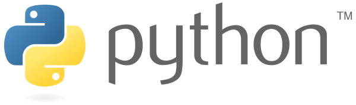

# StudyPython22
2022 빅데이터 분석 과정 - 파이썬 기초 학습

<!-- 
  
-->

### 1일차
- 기본 문법
- 베이스 실행코드 구조

### 2일차
- 기본 문법
- 베이스 실행코드 구조

### 3일차
- 기본 문법
- 베이스 실행코드 구조

### 4일차
- 기본 문법
- 베이스 실행코드 구조

### 5일차
- 기본 문법
- 베이스 실행코드 구조

### 6일차
- 기본 문법
- 베이스 실행코드 구조